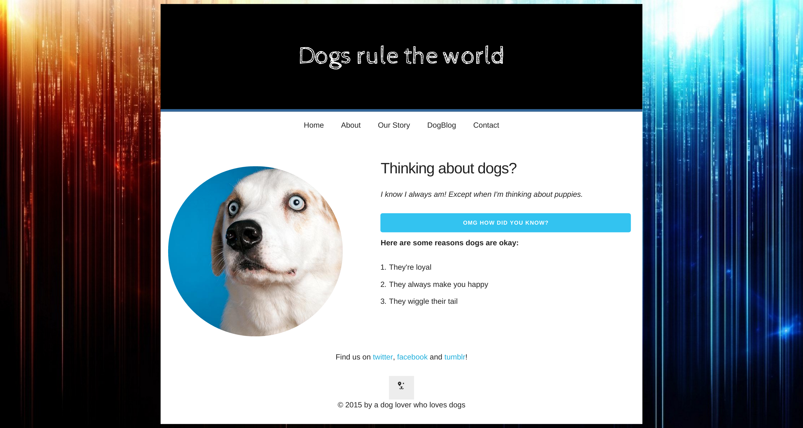

# HTML + CSS Practice

This morning we are going to practice some more html and css. You need to recreate the mockup shown here

.

We will use a very minimal CSS library to achieve this. Spend around some time exploring the documentation

#### [Skeleton Documentation](http://getskeleton.com/)

Use the skeleton grids system to layout your website. Starter code is provided in the `doggies` folder.
